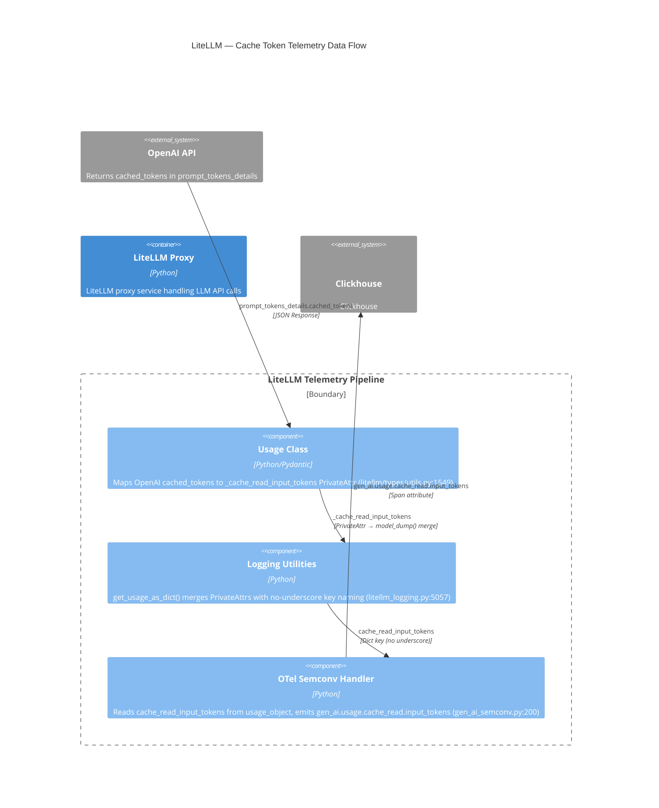

# Component: LiteLLM — Cache Token Telemetry Data Flow

Component-level data flow for cache token telemetry from OpenAI API responses through LiteLLM's internal components to OTel semconv emission and Clickhouse persistence.

## Diagram

## Elements

| ID | Name | Type | Technology | Location | Description |
|----|------|------|-----------|----------|-------------|
| `openai_api` | OpenAI API | System_Ext | REST | External | Returns `prompt_tokens_details.cached_tokens` in API responses |
| `usage` | Usage Class | Component | Python/Pydantic | `litellm/types/utils.py:1549` | Maps OpenAI `cached_tokens` to `_cache_read_input_tokens` PrivateAttr in `__init__` |
| `logging_utils` | Logging Utilities | Component | Python | `litellm/litellm_core_utils/litellm_logging.py:5057` | `get_usage_as_dict()` merges PrivateAttrs into dict output with no-underscore key naming (`cache_read_input_tokens`) |
| `otel_semconv` | OTel Semconv Handler | Component | Python | `litellm/integrations/opentelemetry_utils/gen_ai_semconv.py:200` | Reads `cache_read_input_tokens` from usage_object, emits `gen_ai.usage.cache_read.input_tokens` as span attribute |
| `clickhouse` | Clickhouse | System_Ext | Clickhouse | External | Receives telemetry spans with cache token attributes |

## Data Flow

1. **OpenAI → Usage:** OpenAI API returns `prompt_tokens_details.cached_tokens` in response. Usage class `__init__` extracts and maps to `_cache_read_input_tokens` PrivateAttr.
2. **Usage → Logging:** `get_usage_as_dict()` merges `_cache_read_input_tokens` PrivateAttr into dict as `cache_read_input_tokens` (stripped underscore prefix).
3. **Logging → OTel:** OTel semconv handler reads `cache_read_input_tokens` from usage_object dict, emits `gen_ai.usage.cache_read.input_tokens` as span attribute.
4. **OTel → Clickhouse:** Telemetry spans with cache token attributes persisted to Clickhouse.

## Notes

- **Key naming is critical:** The underscore prefix on PrivateAttr (`_cache_read_input_tokens`) is stripped in `get_usage_as_dict()` to produce `cache_read_input_tokens`, which is the key OTel semconv handler expects. A mismatch here caused the CRITICAL bug where telemetry showed `cached_tokens=0` for all traces.
- **All integrations share this pipeline:** OTel, Langfuse, Prometheus, Arize, Cloudzero, Focus all read `cache_read_input_tokens` from the usage_object dict — a fix here benefits all integrations.
- **PrivateAttrs are excluded from `model_dump()`:** Pydantic excludes PrivateAttrs by default, requiring explicit merge in `get_usage_as_dict()` (4 code paths, all verified).
