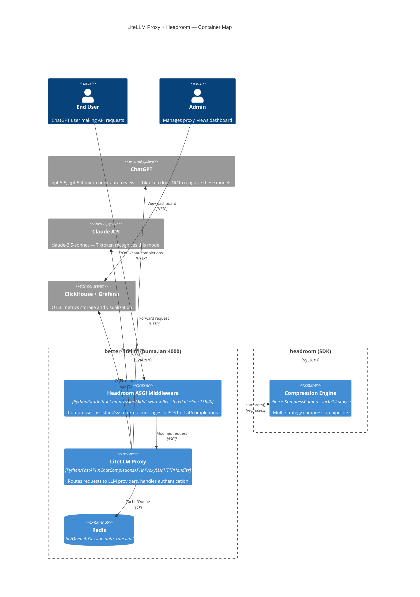

# LiteLLM Proxy + Headroom — Integration Container Map

## Description

Container-level view of better-litellm proxy with headroom compression middleware deployed on puma.lan. The middleware intercepts requests before they reach LiteLLM, compressing messages through the headroom pipeline.

## Diagram

## Elements

| Element | Type | Technology | Description |
|---------|------|-----------|-------------|
| End User | Person | — | ChatGPT user making API requests |
| Admin | Person | — | Manages proxy, views Grafana dashboard |
| ChatGPT | System_Ext | — | gpt-5.5, gpt-5.4-mini, codex-auto-review — **Tiktoken does NOT recognize these** |
| Claude API | System_Ext | — | claude-3.5-sonnet — Tiktoken recognizes this model |
| ClickHouse + Grafana | System_Ext | — | OTEL metrics storage and Grafana visualization |
| Headroom ASGI Middleware | Container | Python/Starlette | CompressionMiddleware registered at ~line 15940 |
| LiteLLM Proxy | Container | Python/FastAPI | Routes requests to LLM providers, handles authentication |
| Redis | ContainerDb | — | Cache, session data, rate limiting |
| Compression Engine | Container | Python | Multi-strategy compression pipeline |

## Key Relationships

1. **ASGI middleware executes BEFORE LiteLLM proxy** — requests intercepted at middleware layer
2. **Compression is in-process** — middleware calls headroom pipeline directly (no network hop)
3. **Only assistant/system/tool messages are compressed** — user messages skipped by design
4. **Tiktoken encoding mismatch** — gpt-5.x models produce zero compression tokens
5. **OTEL metrics flow through ClickHouse** — DELTA temporality, requires `sumIf(delta > 0)` queries

## Notes

- Middleware registered at approximately line 15940 in `proxy_server.py`
- Executes in ASGI reverse order — before `RequestSizeLimitMiddleware`
- Tiktoken encoding mismatch affects ChatGPT models (gpt-5.x) — zero compression tokens recorded
- OTEL metrics use DELTA temporality — ClickHouse converts to cumulative
